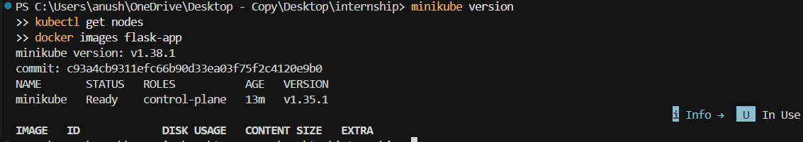
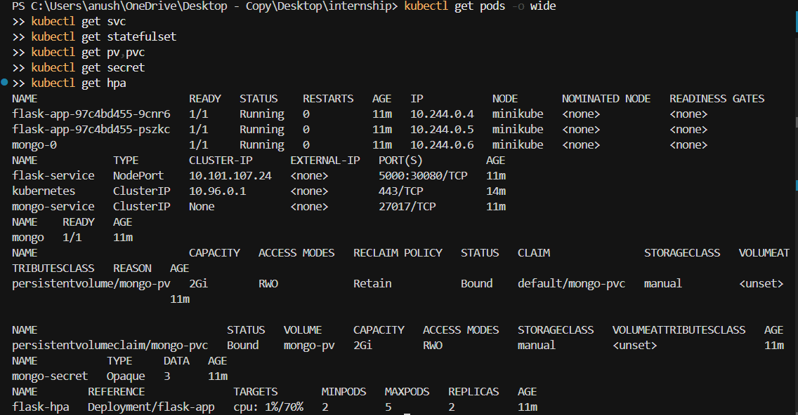
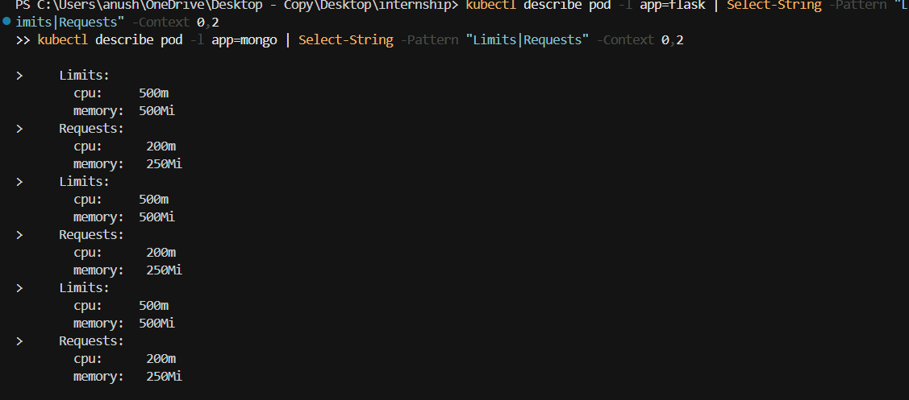
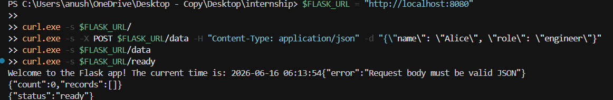
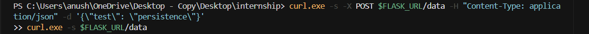
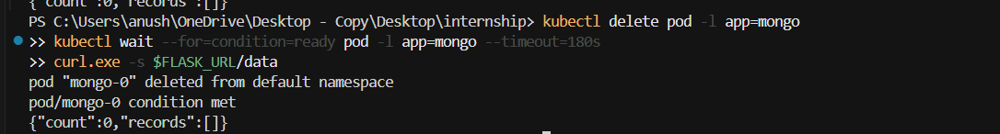
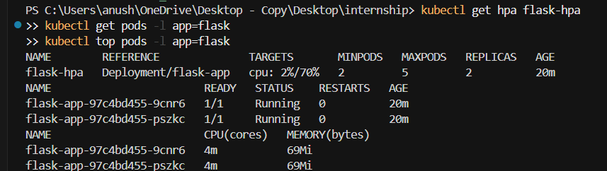
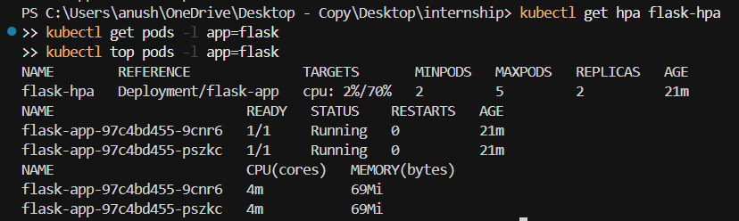

# Flask + MongoDB on Kubernetes (Minikube)

A production-style reference project that deploys a Flask REST API backed by MongoDB on a local Kubernetes cluster using Minikube. The stack includes persistent storage, secrets-based authentication, resource governance, and horizontal pod autoscaling.

---

## Windows Quick Start (read this first)

If you see errors like `k8s/ does not exist`, `minikube is not recognized`, or `dockerDesktopLinuxEngine` pipe not found, fix these **in order**:

### Error 1: `the path "k8s/" does not exist`

You are in the wrong folder. The `k8s/` directory is inside `project/`:

```powershell
cd "C:\Users\anush\OneDrive\Desktop - Copy\Desktop\internship\project"
```

### Error 2: `dockerDesktopLinuxEngine` / Docker pipe not found

**Docker Desktop is not running.**

1. Open **Docker Desktop** from the Start menu.
2. Wait until the whale icon shows **"Docker Desktop is running"**.
3. Verify:

```powershell
docker info
```

### Error 3: `minikube is not recognized`

Minikube is not installed. Install it:

```powershell
winget install Kubernetes.minikube
```

Close and reopen PowerShell, then verify:

```powershell
minikube version
```

### Error 4: `localhost:8080` connection refused (kubectl)

No Kubernetes cluster is running. Start Minikube **after** Docker Desktop is up:

```powershell
minikube start --cpus=4 --memory=6144 --driver=docker
minikube addons enable metrics-server
kubectl get nodes
```

### One-command deploy (after prerequisites above)

From the `project/` folder:

```powershell
cd "C:\Users\anush\OneDrive\Desktop - Copy\Desktop\internship\project"
.\deploy.ps1
```

The script checks Docker, Minikube, builds the image, and applies all manifests.

---

## Interview Review Summary (Issues Found & Fixed)

This project was reviewed as a Kubernetes internship submission. The table below lists every significant issue identified and how it was resolved.

| # | Category | Issue | Fix |
|---|----------|-------|-----|
| 1 | **Security** | Flask used MongoDB **root** credentials | Dedicated `flaskuser` with `readWrite` on `flaskdb` only |
| 2 | **Security** | Credentials duplicated in Secret (`mongodb-uri` + password) | Secret stores discrete keys; app builds URI with URL-encoding |
| 3 | **Security** | API returned raw MongoDB exception messages | Generic error responses; details logged server-side only |
| 4 | **Security** | No pod `securityContext` on Flask | `runAsNonRoot`, dropped capabilities, fixed UID 1000 |
| 5 | **MongoDB Auth** | `MONGO_INITDB_*` only runs on **empty** data dir — undocumented | Documented; troubleshooting covers PVC reset |
| 6 | **MongoDB Auth** | Password `!` in URI needed encoding | Alphanumeric passwords; `urllib.parse.quote` in app |
| 7 | **MongoDB Auth** | `authSource=admin` with app user is wrong | Changed to `authSource=flaskdb` |
| 8 | **MongoDB** | Volume permission denied (mongo UID 999) | Added `fsGroup: 999` and `fsGroupChangePolicy` |
| 9 | **MongoDB** | Init script password hardcoded in ConfigMap | Init container generates script from Secret at runtime |
| 10 | **Kubernetes YAML** | StatefulSet `serviceName` pointed to standard ClusterIP | Headless service (`clusterIP: None`) for StatefulSet identity |
| 11 | **Kubernetes YAML** | Flask started before MongoDB was reachable | `wait-for-mongo` initContainer with TCP check |
| 12 | **Probes** | Liveness `/health` pinged MongoDB — restart loops under load | `/health` = liveness (Flask only); `/ready` = MongoDB check |
| 13 | **Probes** | Docker HEALTHCHECK used DB-dependent endpoint | HEALTHCHECK now hits `/health` only |
| 14 | **HPA** | `GET /` load test barely raises CPU | README uses concurrent `POST /data` for realistic load |
| 15 | **HPA** | Aggressive scale-down caused flapping | 120s stabilization window; scale down 1 pod/60s |
| 16 | **Minikube** | `hostPath` on wrong machine (Windows host vs VM) | Documented path lives on Minikube VM; cleanup via `minikube ssh` |
| 17 | **Minikube** | PV not bound on multi-node clusters | Added `nodeAffinity` guard on PV |
| 18 | **App** | Global `MongoClient` never reset after DB outage | `reset_client()` on failures; reconnect on next request |
| 19 | **App** | `datetime.utcnow()` deprecated in Python 3.12 | Replaced with `datetime.now(timezone.utc)` |
| 20 | **Docker** | UID mismatch between image user and K8s securityContext | Both use UID/GID 1000 |

---

## Project Overview

| Component | Purpose |
|-----------|---------|
| `app.py` | Flask REST API; builds `MONGODB_URI` from secret-backed env vars |
| `Dockerfile` | Non-root image, Gunicorn, lightweight health check |
| `k8s/` | Secrets, PV/PVC, StatefulSet, Deployments, Services, HPA |
| HPA | Scales Flask pods 2 → 5 when CPU exceeds 70% |

### API Endpoints

| Method | Path | Description |
|--------|------|-------------|
| GET | `/` | Welcome message with current date/time |
| POST | `/data` | Insert JSON body into MongoDB |
| GET | `/data` | Retrieve all stored records |
| GET | `/health` | Liveness — Flask process only |
| GET | `/ready` | Readiness — includes MongoDB ping |

---

## Architecture Diagram

```
┌─────────────────────────────────────────────────────────────────────────────┐
│                              Local Machine                                  │
│                                                                             │
│   curl / browser  ──────►  NodePort :30080  ──────►  flask-service          │
└─────────────────────────────────────────────────────────────────────────────┘
                                        │
                                        ▼
┌─────────────────────────────────────────────────────────────────────────────┐
│                           Kubernetes Cluster (Minikube)                     │
│                                                                             │
│  ┌───────────────────────────────────────────────────────────────────────┐  │
│  │                 Flask Deployment (2–5 replicas via HPA)               │  │
│  │                                                                       │  │
│  │  initContainer: wait-for-mongo (TCP check mongo-service:27017)        │  │
│  │                                                                       │  │
│  │  ┌─────────────┐  ┌─────────────┐  ┌─────────────┐                   │  │
│  │  │ flask-pod   │  │ flask-pod   │  │ flask-pod   │  ...              │  │
│  │  │ :5000       │  │ :5000       │  │ :5000       │                   │  │
│  │  └──────┬──────┘  └──────┬──────┘  └──────┬──────┘                   │  │
│  │         └────────────────┼────────────────┘                          │  │
│  │                          │ MONGO_* env → MONGODB_URI (in app)        │  │
│  └──────────────────────────┼───────────────────────────────────────────┘  │
│                             │                                               │
│                             ▼                                               │
│                   ┌──────────────────┐                                      │
│                   │  mongo-service   │  Headless ClusterIP :27017            │
│                   │  (internal only) │  DNS → pod IP directly                │
│                   └────────┬─────────┘                                      │
│                            │                                                │
│                            ▼                                                │
│  ┌───────────────────────────────────────────────────────────────────────┐  │
│  │              MongoDB StatefulSet (1 replica)                          │  │
│  │                                                                       │  │
│  │  initContainer: generate flaskuser init script from Secret            │  │
│  │                                                                       │  │
│  │  ┌─────────────────────────────────────────────────────────────────┐  │  │
│  │  │  mongo:latest  — auth enabled, volume at /data/db, fsGroup:999  │  │  │
│  │  └────────────────────────────┬────────────────────────────────────┘  │  │
│  └───────────────────────────────┼────────────────────────────────────────┘  │
│                                  ▼                                           │
│                       ┌──────────────────┐                                   │
│                       │    mongo-pvc     │  2Gi                               │
│                       └────────┬─────────┘                                   │
│                                ▼                                             │
│                       ┌──────────────────┐                                   │
│                       │     mongo-pv     │  hostPath /data/mongo (Minikube VM)│
│                       └──────────────────┘                                   │
│                                                                              │
│  ┌──────────────┐                                                            │
│  │ mongo-secret │  root-password | username | password                       │
│  └──────────────┘                                                            │
│                                                                              │
│  ┌──────────────┐                                                            │
│  │  flask-hpa   │  CPU > 70% → scale Deployment 2 → 5                       │
│  └──────────────┘                                                            │
└─────────────────────────────────────────────────────────────────────────────┘
```

---

## Prerequisites

| Tool | Version (tested) | Purpose |
|------|------------------|---------|
| Docker | 24+ | Build container images |
| kubectl | 1.28+ | Interact with Kubernetes |
| Minikube | 1.32+ | Local Kubernetes cluster |
| curl | any | API testing |

Optional: **jq** for pretty JSON output.

```bash
docker --version
kubectl version --client
minikube version
```

---

## Project Structure

```
project/
├── app.py
├── requirements.txt
├── Dockerfile
├── deploy.ps1
├── README.md
├── screenshots/          # Submission evidence (8 images)
└── k8s/
    ├── secret.yaml
    ├── mongo-pv.yaml
    ├── mongo-pvc.yaml
    ├── mongo-service.yaml
    ├── mongo-statefulset.yaml
    ├── flask-deployment.yaml
    ├── flask-service.yaml
    └── hpa.yaml
```

---

## Docker Build Instructions

```bash
cd project
docker build -t flask-app:latest .
docker images flask-app
```

---

## Docker Push Instructions

For Minikube, build inside Minikube's Docker daemon (see below) — no registry push needed.

To push to Docker Hub:

```bash
docker tag flask-app:latest <your-username>/flask-app:latest
docker login
docker push <your-username>/flask-app:latest
```

Update `k8s/flask-deployment.yaml`:

```yaml
image: <your-username>/flask-app:latest
imagePullPolicy: Always
```

---

## Minikube Setup

### 1. Start Minikube

```bash
minikube start --cpus=4 --memory=6144 --driver=docker
```

HPA with 5 replicas needs adequate CPU/memory.

### 2. Enable Addons

```bash
minikube addons enable metrics-server
minikube addons enable storage-provisioner
```

Verify metrics-server:

```bash
kubectl get apiservice v1beta1.metrics.k8s.io
kubectl top nodes
```

If `kubectl top` shows no metrics, restart metrics-server:

```bash
kubectl rollout restart deployment metrics-server -n kube-system
```

### 3. Point Docker to Minikube's Daemon

**Linux / macOS:**

```bash
eval $(minikube docker-env)
```

**Windows PowerShell:**

```powershell
& minikube -p minikube docker-env | Invoke-Expression
```

### 4. Build Image Inside Minikube

```bash
cd project
docker build -t flask-app:latest .
```

`imagePullPolicy: IfNotPresent` in the Deployment uses this local image.

---

## Deployment Steps

Apply in dependency order:

```bash
kubectl apply -f k8s/secret.yaml
kubectl apply -f k8s/mongo-pv.yaml
kubectl apply -f k8s/mongo-pvc.yaml
kubectl apply -f k8s/mongo-service.yaml
kubectl apply -f k8s/mongo-statefulset.yaml
```

Wait for MongoDB (first boot can take up to 60 seconds while auth initializes):

```bash
kubectl rollout status statefulset/mongo --timeout=180s
kubectl wait --for=condition=ready pod -l app=mongo --timeout=180s
```

Deploy Flask and HPA:

```bash
kubectl apply -f k8s/flask-deployment.yaml
kubectl apply -f k8s/flask-service.yaml
kubectl apply -f k8s/hpa.yaml
```

```bash
kubectl rollout status deployment/flask-app --timeout=180s
kubectl wait --for=condition=ready pod -l app=flask --timeout=180s
```

Or apply everything at once:

```bash
kubectl apply -f k8s/
```

---

## Verification Commands

```bash
kubectl get nodes
kubectl get pv,pvc
kubectl get secrets
kubectl get statefulset,deployment,svc,hpa
kubectl get pods -o wide
kubectl logs -l app=flask --tail=50
kubectl logs -l app=mongo --tail=50
kubectl describe hpa flask-hpa
```

Get Flask URL:

```bash
minikube service flask-service --url
# or
echo "http://$(minikube ip):30080"
```

---

## Testing Instructions

**Linux / macOS:**

```bash
export FLASK_URL="http://$(minikube ip):30080"
```

**Windows PowerShell:**

```powershell
$FLASK_URL = "http://$(minikube ip):30080"
```

### 1. Test Flask Root Endpoint

```bash
curl -s $FLASK_URL/
```

Expected:

```
Welcome to the Flask app! The current time is: 2026-06-15 14:30:00
```

### 2. Test MongoDB Insert (POST /data)

```bash
curl -s -X POST $FLASK_URL/data \
  -H "Content-Type: application/json" \
  -d '{"name": "Alice", "role": "engineer", "team": "platform"}'
```

```bash
curl -s -X POST $FLASK_URL/data \
  -H "Content-Type: application/json" \
  -d '{"name": "Bob", "role": "developer", "team": "backend"}'
```

### 3. Test MongoDB Retrieval (GET /data)

```bash
curl -s $FLASK_URL/data | jq .
```

### 4. Test Health and Readiness

```bash
curl -s $FLASK_URL/health    # {"status":"ok"}
curl -s $FLASK_URL/ready     # {"status":"ready"}
```

### 5. Persistence Testing

```bash
curl -s -X POST $FLASK_URL/data \
  -H "Content-Type: application/json" \
  -d '{"test": "persistence-check"}'

curl -s $FLASK_URL/data

kubectl delete pod -l app=mongo
kubectl wait --for=condition=ready pod -l app=mongo --timeout=180s

curl -s $FLASK_URL/data   # records should still exist
```

### 6. HPA Testing with Load Generation

Watch scaling in two terminals:

```bash
# Terminal 1
kubectl get hpa flask-hpa -w

# Terminal 2
kubectl get pods -l app=flask -w
```

Generate CPU load with concurrent writes (more CPU than `GET /`):

```bash
kubectl run load-generator \
  --image=curlimages/curl:8.7.1 \
  --restart=Never \
  --command -- \
  sh -c 'end=$((SECONDS+300)); while [ $SECONDS -lt $end ]; do for i in $(seq 1 30); do curl -s -X POST http://flask-service:5000/data -H "Content-Type: application/json" -d "{\"load\":$i,\"ts\":$SECONDS}" > /dev/null & done; wait; done'
```

Monitor:

```bash
kubectl get hpa flask-hpa
kubectl top pods -l app=flask
kubectl get pods -l app=flask
```

Clean up:

```bash
kubectl delete pod load-generator --ignore-not-found
```

### 7. kubectl Verification Checklist

```bash
kubectl get pvc mongo-pvc                              # STATUS: Bound
kubectl get secret mongo-secret
kubectl get svc mongo-service -o wide                  # CLUSTER-IP: None (headless)
kubectl get svc flask-service                          # NodePort 30080
kubectl describe pod -l app=flask | grep -A 6 "Limits"
kubectl describe pod -l app=mongo | grep -A 6 "Limits"
kubectl describe hpa flask-hpa
```

---

## Screenshots (Submission Evidence)

Save **8 combined screenshots** in [`screenshots/`](./screenshots/). Run the commands for each batch in one terminal, then capture the full window.

| # | File | What it proves |
|---|------|----------------|
| 1 | `01-setup.png` | Minikube, cluster node Ready, Docker image built |
| 2 | `02-k8s-all.png` | Pods, Services, StatefulSet, PV/PVC, Secret, HPA |
| 3 | `03-limits.png` | CPU/Memory requests and limits on Flask and MongoDB |
| 4 | `04-api-all.png` | GET `/`, POST `/data`, GET `/data`, `/ready` |
| 5 | `05-persist-before.png` | Data exists before MongoDB pod delete |
| 6 | `05-persist-after.png` | Same data after MongoDB pod recreate |
| 7 | `06-hpa-before.png` | HPA at minimum 2 replicas (idle) |
| 8 | `07-hpa-scaled.png` | CPU above 70% and replicas scaled up |

### SS-1 — Setup

```powershell
minikube version
kubectl get nodes
docker images flask-app
```



### SS-2 — All Kubernetes resources (one screenshot)

```powershell
kubectl get pods -o wide
kubectl get svc
kubectl get statefulset
kubectl get pv,pvc
kubectl get secret
kubectl get hpa
```



### SS-3 — Resource limits

**Windows PowerShell:**

```powershell
kubectl describe pod -l app=flask | Select-String -Pattern "Limits|Requests" -Context 0,2
kubectl describe pod -l app=mongo | Select-String -Pattern "Limits|Requests" -Context 0,2
```

**Linux / macOS:**

```bash
kubectl describe pod -l app=flask | grep -A 6 "Limits"
kubectl describe pod -l app=mongo | grep -A 6 "Limits"
```



### SS-4 — API tests (one screenshot)

```powershell
$FLASK_URL = "http://$(minikube ip):30080"
curl.exe -s $FLASK_URL/
curl.exe -s -X POST $FLASK_URL/data -H "Content-Type: application/json" -d '{\"name\": \"Alice\", \"role\": \"engineer\"}'
curl.exe -s $FLASK_URL/data
curl.exe -s $FLASK_URL/ready
```



### SS-5 — Persistence (two screenshots: before and after)

**Before deleting the MongoDB pod:**

```powershell
curl.exe -s -X POST $FLASK_URL/data -H "Content-Type: application/json" -d '{\"test\": \"persistence-check\"}'
curl.exe -s $FLASK_URL/data
```



**Delete pod, wait, then verify:**

```powershell
kubectl delete pod -l app=mongo
kubectl wait --for=condition=ready pod -l app=mongo --timeout=180s
curl.exe -s $FLASK_URL/data
```



### SS-6 & SS-7 — HPA (see [Autoscaling Results and Screenshots](#autoscaling-results-and-screenshots) below)

---

## Autoscaling Results and Screenshots

### HPA configuration

| Setting | Value |
|---------|-------|
| HPA name | `flask-hpa` |
| Target | Deployment `flask-app` |
| Min replicas | 2 |
| Max replicas | 5 |
| CPU target | 70% of pod CPU **request** (200m) |
| Metrics source | Minikube `metrics-server` addon |

### Baseline (before load) — SS-6

```powershell
kubectl get hpa flask-hpa
kubectl get pods -l app=flask
kubectl top pods -l app=flask
```

Expected: **2** Flask replicas, CPU utilization below 70%.



### Load generation

Run a temporary in-cluster load generator (5 minutes of concurrent `POST /data` requests):

```bash
kubectl run load-generator \
  --image=curlimages/curl:8.7.1 \
  --restart=Never \
  --command -- \
  sh -c 'end=$((SECONDS+300)); while [ $SECONDS -lt $end ]; do for i in $(seq 1 30); do curl -s -X POST http://flask-service:5000/data -H "Content-Type: application/json" -d "{\"load\":$i,\"ts\":$SECONDS}" > /dev/null & done; wait; done'
```

Monitor in separate terminals:

```bash
kubectl get hpa flask-hpa -w
kubectl get pods -l app=flask -w
```

### Under load (scaled up) — SS-7

After 1–2 minutes, capture all three commands in one screenshot:

```powershell
kubectl get hpa flask-hpa
kubectl get pods -l app=flask
kubectl top pods -l app=flask
```

Expected: CPU **TARGETS** above **70%**, replicas increased from **2** to **3–5**.



### Scale-down behavior

After deleting the load generator, CPU drops and the HPA scales down gradually (120s stabilization window, then 1 pod per 60s):

```bash
kubectl delete pod load-generator --ignore-not-found
kubectl get hpa flask-hpa -w
```

### Results summary

| Phase | Replicas | CPU target | Notes |
|-------|----------|------------|-------|
| Idle | 2 | Below 70% | Minimum replicas |
| Under load | 4 | Above 70% | HPA scaled Flask Deployment from 2 to 4 replicas |
| After load stops | 2 (gradual) | Below 70% | Scale-down over ~2–3 minutes |

---

## MongoDB Authentication Explanation

### Bootstrap (first startup only)

When `/data/db` is empty, the official `mongo:latest` entrypoint:

1. Creates root user `root` with password from `root-password` in the Secret.
2. Runs `/docker-entrypoint-initdb.d/01-init-flask-user.js`, which creates `flaskuser` with `readWrite` on `flaskdb`.

### Application connection

Flask pods receive discrete environment variables from the Secret:

| Variable | Value |
|----------|-------|
| `MONGO_USERNAME` | `flaskuser` |
| `MONGO_PASSWORD` | from Secret |
| `MONGO_HOST` | `mongo-service` |
| `MONGO_AUTH_SOURCE` | `flaskdb` |

At startup, `app.py` builds and sets `MONGODB_URI`:

```
mongodb://flaskuser:<password>@mongo-service:27017/flaskdb?authSource=flaskdb
```

Passwords are URL-encoded with `urllib.parse.quote` to handle special characters safely.

### Important

`MONGO_INITDB_*` and init scripts run **only when the data directory is empty**. If you change credentials or redeploy with a stale volume, wipe the PVC (see Troubleshooting).

---

## Kubernetes DNS Resolution Explanation

| DNS Name | Resolves To |
|----------|-------------|
| `mongo-service` | Pod IP(s) via headless service |
| `mongo-0.mongo-service.default.svc.cluster.local` | MongoDB pod-0 directly |
| `flask-service` | Flask ClusterIP (or pod endpoints) |

`mongo-service` is a **headless** ClusterIP service (`clusterIP: None`). DNS returns the pod's IP directly instead of a virtual IP, which is the correct pattern for StatefulSets.

Flask connects using the short name `mongo-service` (same namespace). CoreDNS resolves it automatically.

MongoDB is **not** exposed outside the cluster. Flask uses **NodePort 30080** for external access during development.

---

## Resource Requests and Limits Explanation

```yaml
resources:
  requests:
    cpu: 200m       # 0.2 CPU cores — scheduler placement guarantee
    memory: 250Mi   # 250 MiB — scheduler placement guarantee
  limits:
    cpu: 500m       # throttled above 0.5 cores
    memory: 500Mi   # OOMKilled above 500 MiB
```

**HPA formula:** `CPU utilization = actual CPU usage / CPU request`

CPU requests **must** be set for CPU-based HPA to function. Without requests, utilization is undefined.

> **Note:** 500Mi memory limit is tight for MongoDB in production. It is kept as specified by the assignment requirements.

---

## Design Choices

| Decision | Rationale |
|----------|-----------|
| Dedicated `flaskuser` instead of root | Principle of least privilege |
| App builds `MONGODB_URI` at runtime | Avoids duplicate credentials in Secret; handles URL encoding |
| Headless `mongo-service` | Correct StatefulSet networking pattern |
| `fsGroup: 999` on MongoDB pod | Fixes PVC write permissions for mongodb user |
| Init container for MongoDB scripts | Injects credentials from Secret without hardcoding in ConfigMap |
| `wait-for-mongo` init container | Prevents Flask crash-loops during MongoDB startup |
| Split `/health` and `/ready` | Prevents liveness restarts when only MongoDB is slow |
| `imagePullPolicy: IfNotPresent` | Works with locally built Minikube images |
| Manual `hostPath` PV | Satisfies assignment PV/PVC binding; works on single-node Minikube |
| Gunicorn with 2 workers, 4 threads | Production WSGI server; handles concurrent requests |

---

## Troubleshooting

### Flask Pods in `CrashLoopBackOff`

```bash
kubectl logs -l app=flask --tail=100
kubectl describe pod -l app=flask
```

- MongoDB not ready — wait for mongo pod `Running` and `ready`
- Auth failure — see "Authentication Failed" below
- Image not found — rebuild with `minikube docker-env` active

### MongoDB Pod Not Starting / Permission Denied

```bash
kubectl describe pod -l app=mongo
kubectl logs -l app=mongo
```

- Check PVC is Bound: `kubectl get pvc mongo-pvc`
- `fsGroup: 999` should fix permissions; if not, wipe PV data (below)

### PVC Stuck in `Pending`

```bash
kubectl describe pvc mongo-pvc
kubectl get pv mongo-pv
```

Ensure PV exists, `storageClassName: manual` matches, and PV is not bound elsewhere.

### Cannot Reach Flask from Local Machine

```bash
minikube status
kubectl get svc flask-service
minikube service flask-service --url
```

### HPA Shows `<unknown>` for CPU

```bash
minikube addons enable metrics-server
kubectl rollout restart deployment metrics-server -n kube-system
sleep 60
kubectl top pods
kubectl describe hpa flask-hpa
```

### Authentication Failed

Stale PVC data from a previous deployment with different credentials:

```bash
kubectl delete -f k8s/flask-deployment.yaml
kubectl delete -f k8s/flask-service.yaml
kubectl delete -f k8s/hpa.yaml
kubectl delete -f k8s/mongo-statefulset.yaml
kubectl delete -f k8s/mongo-service.yaml
kubectl delete -f k8s/mongo-pvc.yaml
kubectl delete -f k8s/mongo-pv.yaml

minikube ssh -- sudo rm -rf /data/mongo

kubectl apply -f k8s/
```

### Reset Everything

```bash
kubectl delete -f k8s/ --ignore-not-found
minikube ssh -- sudo rm -rf /data/mongo
minikube delete
minikube start --cpus=4 --memory=6144
```

---

## Cleanup

```bash
kubectl delete -f k8s/ --ignore-not-found
minikube ssh -- sudo rm -rf /data/mongo
minikube stop
```

---

## License

Educational / internship assignment use.
